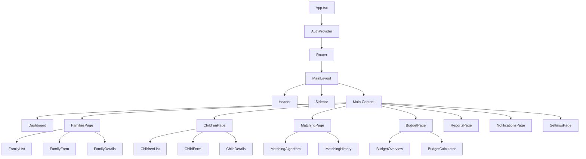
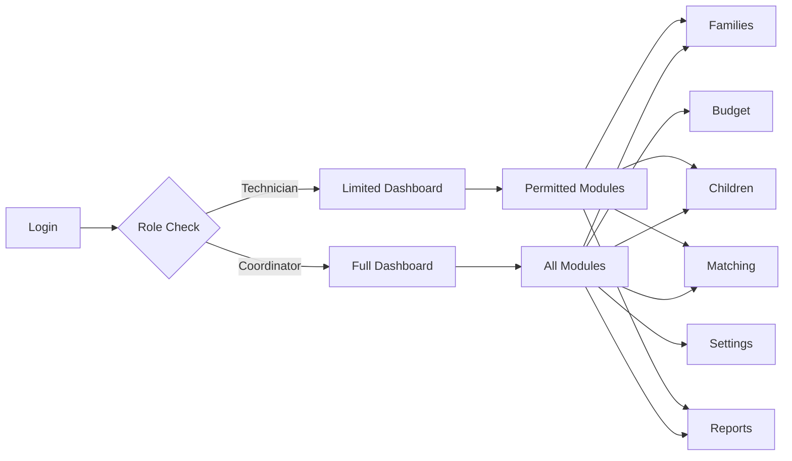
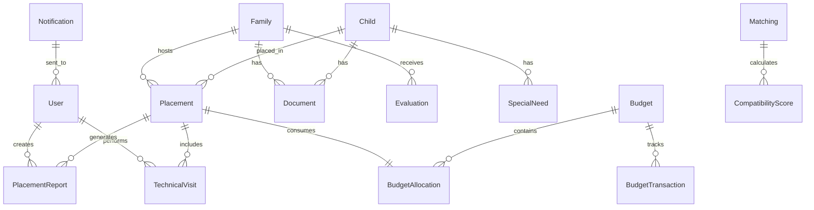

# Foster Family Management Application Design

## Overview

The Foster Family Management Application (Família Acolhedora) is a comprehensive system designed to manage temporary care placement of children and adolescents in Brazil. The system provides a complete solution for coordinating foster families, managing children profiles, facilitating matching processes, and ensuring compliance with Brazilian data protection laws (LGPD) and child welfare regulations.

The application features role-based access control with two primary user types: Coordinators (administrators with full system access) and Technicians (with configurable permissions set by coordinators). The system includes budget management based on Brazilian minimum wage calculations and comprehensive reporting capabilities.

## Technology Stack & Dependencies

### Frontend
- **Framework**: React 18+ with TypeScript
- **Build Tool**: Vite for fast development and optimized builds
- **Styling**: Tailwind CSS for responsive design
- **Routing**: React Router DOM for navigation
- **State Management**: React Context API with custom hooks
- **UI Components**: Custom components with Tailwind CSS
- **Form Handling**: React Hook Form with validation
- **PDF Generation**: jsPDF or react-pdf for report exports
- **File Upload**: Custom upload components with validation

### Backend Architecture
- **API**: RESTful API with Express.js/Node.js or similar
- **Database**: PostgreSQL for structured data with relationship support
- **Authentication**: JWT-based authentication with role management
- **File Storage**: Secure file storage system for documents
- **Encryption**: AES encryption for sensitive data
- **Audit Logging**: Comprehensive action tracking for LGPD compliance

## Component Architecture

### Component Hierarchy



### Core Components

#### Authentication Components
- **LoginPage**: Modern, responsive login interface with role selection
- **AuthProvider**: Context provider for authentication state management
- **ProtectedRoute**: Route wrapper for access control
- **RoleGuard**: Component-level permission checking

#### Layout Components
- **MainLayout**: Primary application layout with responsive sidebar
- **Header**: Top navigation with user info and notifications
- **Sidebar**: Navigation menu with role-based visibility
- **LoadingSpinner**: Global loading indicator

#### Family Management Components
- **FamilyList**: Paginated list with filtering and search
- **FamilyForm**: Multi-step form for family registration
- **FamilyCard**: Summary card display for families
- **FamilyDetails**: Comprehensive family profile view
- **DocumentUpload**: Secure file upload component
- **FamilyStatus**: Status management component

#### Children Management Components
- **ChildrenList**: List view with advanced filtering
- **ChildForm**: Detailed child registration form
- **ChildCard**: Child profile summary
- **ChildDetails**: Complete child profile view
- **SpecialNeeds**: Component for managing special requirements
- **LegalStatus**: Legal documentation tracking

#### Matching System Components
- **MatchingDashboard**: Overview of matching opportunities
- **CompatibilityMatrix**: Algorithm-based matching display
- **MatchingProcess**: Step-by-step matching workflow
- **ApproximationTimeline**: Process tracking component

#### Budget Management Components
- **BudgetOverview**: Total budget display and allocation
- **BudgetCalculator**: Real-time cost calculation
- **CostBreakdown**: Detailed expense analysis
- **BudgetSettings**: Configuration interface

## Routing & Navigation

### Route Structure

```typescript
interface RouteConfig {
  path: string;
  component: React.ComponentType;
  roles: UserRole[];
  exact?: boolean;
}

const routes: RouteConfig[] = [
  { path: '/', component: Dashboard, roles: ['coordinator', 'technician'] },
  { path: '/families', component: FamiliesPage, roles: ['coordinator', 'technician'] },
  { path: '/children', component: ChildrenPage, roles: ['coordinator', 'technician'] },
  { path: '/matching', component: MatchingPage, roles: ['coordinator', 'technician'] },
  { path: '/budget', component: BudgetPage, roles: ['coordinator'] },
  { path: '/reports', component: ReportsPage, roles: ['coordinator', 'technician'] },
  { path: '/notifications', component: NotificationsPage, roles: ['coordinator', 'technician'] },
  { path: '/settings', component: SettingsPage, roles: ['coordinator'] }
];
```

### Navigation Flow



## Styling Strategy

### Design System
- **Primary Colors**: Warm, caring tones (blues, greens) for trust and security
- **Secondary Colors**: Soft accent colors for status indicators
- **Typography**: Clean, readable fonts with proper hierarchy
- **Spacing**: Consistent 8px grid system
- **Border Radius**: Consistent rounded corners for modern feel

### Responsive Breakpoints
- **Mobile**: 320px - 767px
- **Tablet**: 768px - 1023px
- **Desktop**: 1024px+

### Tailwind Configuration
```javascript
module.exports = {
  theme: {
    extend: {
      colors: {
        primary: {
          50: '#eff6ff',
          500: '#3b82f6',
          600: '#2563eb',
          700: '#1d4ed8'
        },
        caring: {
          50: '#f0fdf4',
          500: '#22c55e',
          600: '#16a34a'
        }
      }
    }
  }
}
```

## State Management

### Context Providers

#### AuthContext
```typescript
interface AuthContextType {
  user: User | null;
  login: (credentials: LoginCredentials) => Promise<void>;
  logout: () => void;
  hasPermission: (permission: Permission) => boolean;
  isLoading: boolean;
}
```

#### FamilyContext
```typescript
interface FamilyContextType {
  families: Family[];
  selectedFamily: Family | null;
  addFamily: (family: CreateFamilyRequest) => Promise<void>;
  updateFamily: (id: string, updates: UpdateFamilyRequest) => Promise<void>;
  deleteFamily: (id: string) => Promise<void>;
  setFamilyStatus: (id: string, status: FamilyStatus) => Promise<void>;
}
```

#### ChildrenContext
```typescript
interface ChildrenContextType {
  children: Child[];
  selectedChild: Child | null;
  addChild: (child: CreateChildRequest) => Promise<void>;
  updateChild: (id: string, updates: UpdateChildRequest) => Promise<void>;
  assignToFamily: (childId: string, familyId: string) => Promise<void>;
}
```

#### BudgetContext
```typescript
interface BudgetContextType {
  totalBudget: number;
  allocatedBudget: number;
  availableBudget: number;
  updateTotalBudget: (amount: number) => Promise<void>;
  calculateChildCost: (child: Child, siblings?: Child[]) => number;
  budgetHistory: BudgetTransaction[];
}
```

## API Integration Layer

### Service Architecture

#### Authentication Service
```typescript
class AuthService {
  login(credentials: LoginCredentials): Promise<AuthResponse>
  logout(): Promise<void>
  refreshToken(): Promise<string>
  validatePermissions(userId: string): Promise<Permission[]>
}
```

#### Family Service
```typescript
class FamilyService {
  getAllFamilies(filters?: FamilyFilters): Promise<Family[]>
  getFamilyById(id: string): Promise<Family>
  createFamily(family: CreateFamilyRequest): Promise<Family>
  updateFamily(id: string, updates: UpdateFamilyRequest): Promise<Family>
  deleteFamily(id: string): Promise<void>
  uploadDocuments(familyId: string, files: File[]): Promise<Document[]>
}
```

#### Children Service
```typescript
class ChildrenService {
  getAllChildren(filters?: ChildFilters): Promise<Child[]>
  getChildById(id: string): Promise<Child>
  createChild(child: CreateChildRequest): Promise<Child>
  updateChild(id: string, updates: UpdateChildRequest): Promise<Child>
  assignToFamily(childId: string, familyId: string): Promise<Placement>
}
```

#### Matching Service
```typescript
class MatchingService {
  findCompatibleFamilies(childId: string): Promise<CompatibilityScore[]>
  createMatching(childId: string, familyId: string): Promise<Matching>
  getMatchingHistory(childId?: string, familyId?: string): Promise<Matching[]>
  updateMatchingStatus(matchingId: string, status: MatchingStatus): Promise<Matching>
}
```

#### Budget Service
```typescript
class BudgetService {
  getBudgetOverview(): Promise<BudgetSummary>
  calculateCost(child: Child, siblings?: Child[]): Promise<number>
  updateTotalBudget(amount: number): Promise<void>
  getBudgetHistory(): Promise<BudgetTransaction[]>
  allocateBudget(placement: Placement): Promise<BudgetAllocation>
}
```

## Data Models & ORM Mapping

### Core Entities

#### User Entity
```typescript
interface User {
  id: string;
  email: string;
  name: string;
  role: 'coordinator' | 'technician';
  permissions: Permission[];
  isActive: boolean;
  lastLogin: Date;
  createdAt: Date;
  updatedAt: Date;
}
```

#### Family Entity
```typescript
interface Family {
  id: string;
  primaryContact: {
    name: string;
    cpf: string;
    phone: string;
    email: string;
  };
  address: Address;
  composition: FamilyMember[];
  status: 'available' | 'unavailable' | 'under_evaluation' | 'active_placement';
  preferences: {
    ageRange: { min: number; max: number };
    gender: 'any' | 'male' | 'female';
    specialNeeds: boolean;
    maxChildren: number;
  };
  limitations: string[];
  history: PlacementHistory[];
  documents: Document[];
  evaluations: Evaluation[];
  createdAt: Date;
  updatedAt: Date;
}
```

#### Child Entity
```typescript
interface Child {
  id: string;
  personalInfo: {
    name: string;
    birthDate: Date;
    gender: 'male' | 'female';
    cpf?: string;
    birthCertificate: string;
  };
  currentStatus: 'awaiting' | 'in_placement' | 'discharged' | 'returned_family';
  specialNeeds: {
    hasSpecialNeeds: boolean;
    healthConditions: string[];
    medications: string[];
    educationalNeeds: string[];
  };
  familyBackground: {
    originFamily: string;
    siblings: string[];
    communityTies: string[];
  };
  legalStatus: {
    courtOrder: string;
    legalGuardian: string;
    placementDate?: Date;
    expectedDuration?: number;
  };
  currentPlacement?: {
    familyId: string;
    startDate: Date;
    endDate?: Date;
    status: PlacementStatus;
  };
  documents: Document[];
  createdAt: Date;
  updatedAt: Date;
}
```

#### Placement Entity
```typescript
interface Placement {
  id: string;
  childId: string;
  familyId: string;
  startDate: Date;
  endDate?: Date;
  status: 'active' | 'completed' | 'interrupted' | 'transferred';
  approximationProcess: {
    stages: ApproximationStage[];
    currentStage: string;
    startDate: Date;
  };
  reports: PlacementReport[];
  visits: TechnicalVisit[];
  budget: {
    monthlyAllocation: number;
    totalCost: number;
    paymentHistory: Payment[];
  };
  createdAt: Date;
  updatedAt: Date;
}
```

#### Budget Entity
```typescript
interface Budget {
  id: string;
  fiscalYear: number;
  totalAmount: number;
  allocatedAmount: number;
  availableAmount: number;
  allocations: BudgetAllocation[];
  transactions: BudgetTransaction[];
  settings: {
    minimumWage: number;
    siblingMultiplier: number; // 30%
    specialNeedsMultiplier: number; // 50%
  };
  createdAt: Date;
  updatedAt: Date;
}
```

### Database Schema Relationships



## Business Logic Layer

### Matching Algorithm Architecture

#### Compatibility Scoring System
```typescript
interface CompatibilityFactors {
  ageRange: number;        // Weight: 25%
  specialNeeds: number;    // Weight: 30%
  familySize: number;      // Weight: 15%
  experience: number;      // Weight: 20%
  availability: number;    // Weight: 10%
}

class MatchingAlgorithm {
  calculateCompatibility(child: Child, family: Family): CompatibilityScore {
    const scores = {
      ageRange: this.scoreAgeCompatibility(child.age, family.preferences.ageRange),
      specialNeeds: this.scoreSpecialNeedsCompatibility(child.specialNeeds, family.capabilities),
      familySize: this.scoreFamilySize(family.composition, child.familyBackground),
      experience: this.scoreExperience(family.history, child.specialNeeds),
      availability: this.scoreAvailability(family.status, family.currentPlacements)
    };
    
    return this.calculateWeightedScore(scores);
  }
}
```

### Budget Calculation System

#### Brazilian Budget Rules Implementation
```typescript
class BudgetCalculator {
  private minimumWage: number;
  private siblingMultiplier = 0.30;
  private specialNeedsMultiplier = 0.50;
  
  calculateChildCost(child: Child, siblings: Child[] = []): number {
    let baseCost = this.minimumWage;
    
    // Special needs calculation
    if (child.specialNeeds.hasSpecialNeeds) {
      baseCost += this.minimumWage * this.specialNeedsMultiplier;
    }
    
    // Sibling calculation
    if (siblings.length > 0) {
      const additionalSiblings = siblings.length;
      const siblingCost = this.minimumWage * this.siblingMultiplier * additionalSiblings;
      baseCost += siblingCost;
    }
    
    return baseCost;
  }
  
  validateBudgetAvailability(placements: Placement[]): BudgetValidation {
    const totalCost = placements.reduce((sum, placement) => {
      return sum + this.calculatePlacementCost(placement);
    }, 0);
    
    return {
      isValid: totalCost <= this.availableBudget,
      totalCost,
      availableBudget: this.availableBudget,
      shortage: Math.max(0, totalCost - this.availableBudget)
    };
  }
}
```

### Notification System

#### Automated Reminder System
```typescript
class NotificationService {
  scheduleReportReminders(placement: Placement): void {
    const reportDueDates = this.calculateReportSchedule(placement.startDate);
    
    reportDueDates.forEach(dueDate => {
      this.scheduleNotification({
        type: 'report_due',
        recipientId: placement.assignedTechnician,
        scheduledFor: subDays(dueDate, 7), // 7 days before
        data: { placementId: placement.id, dueDate }
      });
    });
  }
  
  scheduleVisitReminders(visit: TechnicalVisit): void {
    this.scheduleNotification({
      type: 'visit_reminder',
      recipientId: visit.technicianId,
      scheduledFor: subDays(visit.scheduledDate, 1),
      data: { visitId: visit.id, familyId: visit.familyId }
    });
  }
}
```

## Security & Compliance

### LGPD Compliance Implementation

#### Data Subject Rights Management
```typescript
class LGPDComplianceService {
  async handleDataAccess(subjectId: string): Promise<PersonalDataReport> {
    const data = await this.collectPersonalData(subjectId);
    return this.generateDataReport(data);
  }
  
  async handleDataDeletion(subjectId: string): Promise<DeletionReport> {
    const deletionPlan = await this.createDeletionPlan(subjectId);
    return this.executeDataDeletion(deletionPlan);
  }
  
  async handleDataPortability(subjectId: string): Promise<PortableData> {
    const data = await this.collectPortableData(subjectId);
    return this.formatForPortability(data);
  }
}
```

#### Audit Logging System
```typescript
class AuditLogger {
  logDataAccess(userId: string, resourceType: string, resourceId: string): void {
    this.createAuditEntry({
      action: 'DATA_ACCESS',
      userId,
      resourceType,
      resourceId,
      timestamp: new Date(),
      ipAddress: this.getClientIP(),
      userAgent: this.getUserAgent()
    });
  }
  
  logDataModification(userId: string, changes: DataChange[]): void {
    changes.forEach(change => {
      this.createAuditEntry({
        action: 'DATA_MODIFICATION',
        userId,
        resourceType: change.resourceType,
        resourceId: change.resourceId,
        previousValue: this.encrypt(change.previousValue),
        newValue: this.encrypt(change.newValue),
        timestamp: new Date()
      });
    });
  }
}
```

### Data Encryption Strategy

#### Sensitive Data Protection
```typescript
class EncryptionService {
  encryptSensitiveFields(data: any): any {
    const sensitiveFields = ['cpf', 'phone', 'email', 'address'];
    
    return Object.keys(data).reduce((encrypted, key) => {
      if (sensitiveFields.includes(key)) {
        encrypted[key] = this.encrypt(data[key]);
      } else {
        encrypted[key] = data[key];
      }
      return encrypted;
    }, {});
  }
  
  decryptForAuthorizedUser(data: any, userId: string): any {
    if (!this.isAuthorizedForDecryption(userId)) {
      throw new UnauthorizedError('User not authorized for data decryption');
    }
    
    return this.decryptSensitiveFields(data);
  }
}
```

## Testing Strategy

### Unit Testing Approach

#### Component Testing
```typescript
describe('FamilyForm Component', () => {
  it('should validate required fields', async () => {
    render(<FamilyForm onSubmit={mockSubmit} />);
    
    fireEvent.click(screen.getByText('Submit'));
    
    await waitFor(() => {
      expect(screen.getByText('Name is required')).toBeInTheDocument();
      expect(screen.getByText('CPF is required')).toBeInTheDocument();
    });
  });
  
  it('should calculate budget correctly for special needs child', () => {
    const child = createMockChild({ hasSpecialNeeds: true });
    const calculator = new BudgetCalculator();
    
    const cost = calculator.calculateChildCost(child);
    
    expect(cost).toBe(minimumWage * 1.5); // Base + 50% for special needs
  });
});
```

#### Integration Testing
```typescript
describe('Matching Service Integration', () => {
  it('should find compatible families for child', async () => {
    const child = await createTestChild();
    const families = await createTestFamilies(5);
    
    const matches = await matchingService.findCompatibleFamilies(child.id);
    
    expect(matches).toHaveLength(3);
    expect(matches[0].score).toBeGreaterThan(0.8);
  });
});
```

### End-to-End Testing

#### Critical User Flows
```typescript
describe('Foster Placement Flow', () => {
  it('should complete full placement process', async () => {
    await loginAs('coordinator');
    
    // Navigate to matching
    await page.click('[data-testid="matching-nav"]');
    
    // Select child and family
    await page.click('[data-testid="child-1"]');
    await page.click('[data-testid="family-1"]');
    
    // Start approximation process
    await page.click('[data-testid="start-approximation"]');
    
    // Verify budget allocation
    const budgetElement = await page.$('[data-testid="allocated-budget"]');
    const allocatedAmount = await budgetElement.textContent();
    
    expect(allocatedAmount).toContain('R$ 1.320,00'); // Minimum wage
  });
});
```